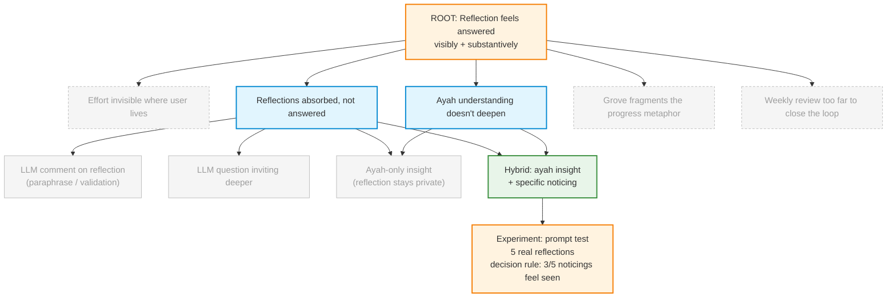

# Discovery Brief — Answered Reflection

## Root Outcome

A user finishes reflecting and feels the act was answered — both **visibly**
(effort accumulates where they live) and **substantively** (they received
insight they didn't have before).

**Why this matters:** Ghars is a reflection product. If a user writes a
reflection and the screen just says "✓ committed," the ritual is absorbed but
not answered. The depth of the reflection experience — not just its completion
— is what decides whether the app is lived with or abandoned.

**Evidence tier:** **Weak** — dogfood only. The owner noticed in their own use
that submitting a reflection felt one-way, and imagined two missing halves:
the tree growing _where they already were_ (now partially addressed on
`/today`), and the reflection being _met with something back_.

**Metric stance:** No leading-indicator tracking this cycle. Validation is by
use, not by measurement. Revisit measurement once multiple users are active.

## Opportunities Considered

| #   | Opportunity                                                  | Cluster             | Evidence               | Status                                                  |
| --- | ------------------------------------------------------------ | ------------------- | ---------------------- | ------------------------------------------------------- |
| 1   | Accumulated effort is invisible where the user lives         | Architecture        | Weak (dogfood)         | **Parked — partially addressed by `/today` hero plant** |
| 2   | Reflections are absorbed, not answered                       | Answered-reflection | Weak (dogfood)         | **Selected**                                            |
| 3   | Users don't deepen their understanding of the ayah over time | Answered-reflection | Weak (dogfood)         | **Selected (clustered with 2)**                         |
| 4   | Grove-as-destination fragments the progress metaphor         | Architecture        | Weak (design instinct) | **Parked — decide after 2/3 ship**                      |
| 5   | Weekly review is too far away to close the loop              | Answered-reflection | Weak (inferred)        | **Parked — partially addressed by 2/3**                 |

## Selected Opportunity

**Opportunities 2 + 3 clustered: the user doesn't receive anything back after
reflecting.** The reflection is absorbed into a database; the tree grows by
one visual stage; no insight, no noticing, no response. Nothing connects
_what the user wrote_ with _what the ayah was saying_ or _what they did today_.

### Rationale

- **Directly moves the outcome.** Closes the "substantive" half of the root
  outcome (user receives insight they didn't have before). The visible half is
  already partially shipped (the plant on `/today`).
- **Owner's stated goal matches.** The owner explicitly said: _"the llm gave
  me insights to my reflections, i understand the ayah more now / i'm aware
  of my actions more now."_ That is a direct statement of this opportunity.
- **Higher leverage than architecture changes.** Opportunities 1 and 4 are
  scope decisions (where does progress live?). They become easier to answer
  _after_ opportunities 2/3 ship, because the answer depends on whether
  `/today` becomes the centre of the app once it responds to the user.
- **Daily, not weekly.** Opportunity 5 is solved for free as a side effect —
  if the user is answered daily, the weekly review no longer has to carry the
  entire "the app noticed you" burden alone.

## Solution Candidates

| #   | Solution                                                                                    | Riskiest Assumption                                                                              | Confidence    |
| --- | ------------------------------------------------------------------------------------------- | ------------------------------------------------------------------------------------------------ | ------------- |
| 1   | LLM comment on the reflection (paraphrase / observation / validation)                       | Users can distinguish insight from flattery                                                      | Low-moderate  |
| 2   | LLM question that invites the user deeper                                                   | Users want to be asked right after doing the work                                                | Moderate      |
| 3   | LLM insight on the ayah only — the reflection stays private                                 | Users care about the verse deepening more than about being seen                                  | Moderate-high |
| 4   | **Hybrid: 2-sentence ayah insight + 1-sentence specific noticing of the user's reflection** | The "noticing" sentence is specific enough to feel seen, not generic enough to read as AI filler | Moderate      |

### Selected: Candidate 4

**Rationale.** The owner's stated goal names _both_ desired feelings — "i
understand the ayah more" (candidate 3) **and** "i'm aware of my actions
more" (candidates 1 or 2). Only candidate 4 delivers both in a single
response. Candidates 1–3 each solve half the goal.

**Trade-off accepted.** Candidate 4 has the highest upside _and_ the highest
downside. A well-prompted noticing ("you mentioned your brother twice") is
the difference between "someone saw me" and "the AI is flattering me." The
experiment below tests exactly this.

## Experiment — Prompt Prototype Test

**Owner as user.** Evidence tier is already dogfood; the cheapest, fastest
test is to let the owner read five outputs and judge.

**Steps:**

1. Author a single prompt that takes `{ayah, translation, tafsir_snippet,
user_reflection}` and returns two blocks — a two-sentence ayah insight
   and a one-sentence specific noticing.
2. Constrain the prompt explicitly: the noticing must reference a specific
   word or phrase the user wrote. Never "your reflection was beautiful."
   Never paraphrasing without adding observation.
3. Run against **5 real reflections** from the owner's history (not synthetic).
4. Score each output on two axes: _Did the ayah insight teach me something?_
   and _Did the noticing feel seen, or flattered/generic/paraphrased?_

**Decision rule:**

- **3 of 5 noticings feel seen** → ship behind a feature flag, wire into the
  reflection-submit flow.
- **1 or 0 feel seen** → the prompt is wrong; iterate the prompt, do not ship.
- **2 feel seen** → ambiguous; run 5 more with prompt adjustments before
  deciding.

**Time budget:** one hour.

**What this does not test.** Where the answer is displayed, whether it's
cached, rate limits, dismissal UX, tone-of-voice variation across focus areas,
multi-day consistency. Those are downstream design decisions — they only
matter if the prompt works at all.

## Deferrals (not discarded)

- **Opportunity 1 + 4 — grove vs. `/today` architecture.** Decide once the
  LLM-answer feature has been lived with for a week. If `/today` becomes the
  place users return to every day, the grove's job changes (from "the home"
  to "history archive") and that decision can be made with real signal
  instead of imagination.
- **Opportunity 5 — weekly review distance.** Partially solved by daily
  answers. Revisit only if weekly review feels thin once daily feedback is
  live.
- **Measurement.** No leading indicators this cycle. Once there are more
  than one active user, consider: reflection-to-return rate; consecutive-day
  reflections that build on the previous day's theme; weekly-review open
  rate as a depth proxy.

## Opportunity Solution Tree

## Decision Log

- **2026-05-02 — Outcome framed as user-felt, not metric-measured.** Owner
  declined a leading-indicator metric for this cycle ("we don't have time").
  Validation is by use. Risk: no objective signal that the feature worked.
  Mitigation: owner is the primary user during validation.
- **2026-05-02 — Opportunities 2, 3, 5 clustered; 1 and 4 parked.** 2/3/5
  all describe the same gap ("no feedback between today and Sunday"). 1 and
  4 are architecture questions that become easier once 2/3 ship.
- **2026-05-02 — Candidate 4 selected over 3.** Candidate 3 (ayah-only) is
  safer and ships faster but solves only half the stated goal. Owner
  confirmed the desired feeling is "someone noticed me today" alongside
  "i understand the verse better" — 4 is the only candidate that delivers
  both.
- **2026-05-02 — Experiment is owner-as-user prompt test.** Evidence tier is
  already dogfood; there is no cheaper or faster honest test than the owner
  reading five real outputs with a pre-committed decision rule.

## PRD

- Candidate 4 was turned into a PRD at
  `docs/specs/TBD-answered-reflection/spec.md` on 2026-05-02.

## Recommended Next Step

Run `/did-workflow:prd docs/discovery/answered-reflection/brief.md` to turn
this brief into a product requirements document — it will pick up the
outcome, chosen solution, and experiment as context.

After the feature has been lived with for a week, run
`/did-workflow:product-discovery` on the parked **grove architecture**
question (opportunities 1 + 4) with real signal from the `/today` experience.
