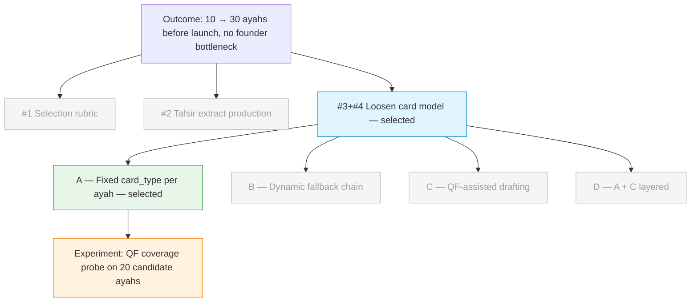

# Discovery Brief: Expand Ayah Rotation Pre-Launch

## Desired Outcome

Grow the rotation from **10 to 30 ayahs before launch** so pre-launch users do
not cycle through the same verses within a month — without the founder writing
every tafsir extract and action prompt by hand.

## Opportunity Map

| #   | Opportunity                                                                                                                                                        | Evidence                                                                                   | Strength | Size                                   |
| --- | ------------------------------------------------------------------------------------------------------------------------------------------------------------------ | ------------------------------------------------------------------------------------------ | -------- | -------------------------------------- |
| 1   | Ayah selection — no repeatable editorial rubric for choosing which ayahs enter rotation                                                                            | Pre-launch, no user signal yet                                                             | Weak     | All users (every slot)                 |
| 2   | Tafsir extract production — writing a ≤200-char on-brand summary per ayah is hand-craft work that doesn't scale                                                    | `corpus-shortlist.json` + `corpus_entries.tafsir_extract` show 10 manually-written entries | Moderate | All users (every ayah)                 |
| 3   | Action prompt production — writing two behavioural "try today" prompts per ayah is the uniquely hand-crafted ingredient; no external source directly provides this | Same file evidence; QF posts are reflections, not behavioural prompts                      | Moderate | All users (every ayah, 2 prompts each) |
| 4   | Rigid single-format card model — every ayah requires extract + 2 prompts even when the material fits a reflection or Q&A more naturally                            | Model assumption in current schema, not tested with users                                  | Weak     | All users (every card)                 |

## Selected Opportunity

**#3 + #4 together: loosen the single-format card model so QF can supply the
ingredients the founder isn't uniquely positioned to write, while the founder
stays the author for behavioural prompts where they matter most.**

Rationale:

- Solving only #2 (tafsir extracts via QF) leaves ~60 prompts to hand-write for
  ayahs 11–30 — QF alone does not unblock launch.
- The hidden assumption in #3 is #4: "every ayah needs two action prompts" is a
  design choice, not a user need. Some ayahs (names of God, creation, mercy)
  are naturally reflective — forcing a behavioural prompt produces weak prompts.
- Loosening the model to three card types (`action`, `reflection`, `qa`) lets
  QF's strengths (verified community reflections, scholar Q&A) carry ~⅔ of
  slots while the founder writes prompts only where they add unique value.

**Deferred (not discarded):**

- #1 — editorial selection rubric. Worth tackling once the rotation exceeds
  ~50 ayahs and a repeatable process matters more than founder taste.
- #2 standalone — absorbed into the hybrid model; tafsir extracts come from
  QF content for reflection/qa cards and from the founder for action cards
  (unchanged for those).

## Solution Candidates

| #   | Solution                                                                                                                                                                                                                                                                     | Riskiest Assumption                                                                                                                          | PRD                                                                                         |
| --- | ---------------------------------------------------------------------------------------------------------------------------------------------------------------------------------------------------------------------------------------------------------------------------- | -------------------------------------------------------------------------------------------------------------------------------------------- | ------------------------------------------------------------------------------------------- |
| 1   | **Solution A — Fixed card-type per ayah.** Add `card_type` column to `corpus_entries` (`action` \| `reflection` \| `qa`). Today-route reads type and joins the right ingredient: founder's prompts for `action`, QF verified post for `reflection`, QF ayah-answer for `qa`. | QF has at least one `verified=true` reflection or one `Published` tafsir answer for each ayah tagged reflection/qa. If not, cards are empty. | [docs/specs/TBD-expand-ayah-rotation/spec.md](../../specs/TBD-expand-ayah-rotation/spec.md) |
| 2   | Solution B — Dynamic fallback chain at assign-time. No card_type column; try founder's prompts, else QF reflection, else QF answer, else plain tafsir-extract.                                                                                                               | The auto-picked card is good enough that users don't feel a quality drop on fallback days. Pre-launch, no user signal to validate.           | —                                                                                           |
| 3   | Solution C — Curated + QF-assisted drafting. Keep current schema. Build a script that pulls top QF reflection + answer into a "draft" output for the founder to edit into `tafsir_extract` and prompts.                                                                      | Drafting from QF is meaningfully faster than writing from scratch — editing another voice could be just as slow.                             | —                                                                                           |
| 4   | Solution D — Hybrid (A + C layered). Tag card_type AND use drafting script to speed up action-card prompt writing.                                                                                                                                                           | The mental overhead of a two-path workflow is worth the speedup — could feel fiddly.                                                         | —                                                                                           |

**Selected: Solution A.** Shippable (schema change + conditional in
`/api/today`), testable, and gives a forcing function to cap reflection/qa at
a chosen ratio (e.g. ≤⅔) so the app stays action-anchored.

## Opportunity Solution Tree



## Recommended Experiment

**QF content coverage probe — ~1–2 hours of effort, zero app changes.**

1. Pick 20 candidate ayahs the founder would reasonably want in slots 11–30.
2. Run a standalone script (`scripts/qf-coverage-probe.ts`) that hits QF twice
   per ayah:
   - `GET apis.quran.foundation/quran-reflect/v1/posts/feed?filter[references][0][chapterId]=X&filter[references][0][from]=Y&filter[verified]=true&limit=5`
   - `GET ayah-answers for X:Y, status=Published`
3. Output a CSV: `ayah_key | verified_posts_count | published_answers_count | top_post_excerpt | top_answer_excerpt`.
4. **Decision rule:** if ≥15 of 20 ayahs return at least one usable item from
   either endpoint, proceed with Solution A. If <15, drop to Solution C
   (human-in-loop drafting) because the ayah pool is too constrained for a
   tag-and-fetch model.

Secondary benefit: the excerpts double as an initial selection sheet and a
qualitative gut-check on QF content feel, not just a coverage count.

**Blocker to run the probe:** the repo's current QF OAuth client is scoped
for `api.quran.com/api/v4` content. The reflections/answers endpoints live on
`apis.quran.foundation` and require `post.read` (and likely `comment.read`)
scopes, which are not yet provisioned.

## Recommendation

Proceed to `/prd` for Solution A with the coverage probe as Story 1:

- **Story 1 — QF gateway + coverage probe.** Provision `post.read` scope on
  the QF client, stand up a second OAuth client config for
  `apis.quran.foundation`, and run the coverage probe on 20 candidate ayahs.
  Gate: if <15/20 return usable content, stop and reopen discovery.
- **Story 2 — card_type schema + tagging.** Add `card_type` column and seed
  types for the 30 ayahs based on probe output.
- **Story 3 — `/api/today` conditional fetch.** Branch on `card_type`; fetch
  QF content at assign-time; sanitize HTML via `isomorphic-dompurify`
  (reuse `convention-tafsir-html-sanitized` path); cache the chosen
  post/answer id on `daily_assignments` so the same user sees the same card
  on reload.
- **Story 4 — UI card variants.** Three Today-card layouts: action (unchanged),
  reflection (with QF attribution), Q&A (question + answer block). The
  ayah/Arabic/translation/Reflect button stay constant across all three.

## Decision Log

- **Outcome framed as 10 → 30 ayahs pre-launch (target: 30, repetition window: ~1 month).** Founder confirmed the observed problem: "user cycle through the same 10 verses repeatedly" is a pre-launch risk, not a post-launch data point. Scoping at 30 keeps the work finite and launch-focused rather than attempting full-corpus coverage.
- **Selected a hybrid of opportunities #3 + #4 over solving #2 alone.** QF's posts feed and ayah-answers endpoints map naturally to reflection and Q&A card types but provide no behavioural "try this today" equivalent. Solving only the extracts leaves the prompt-writing bottleneck intact. Loosening the card model removes that bottleneck mechanically for ~⅔ of slots.
- **Chose Solution A (fixed card_type) over B/C/D.** A is shippable and testable pre-launch; B hides quality issues behind fallbacks we can't validate without users; C keeps the founder in the write-loop; D adds workflow complexity that is unjustified before A ships.
- **Product-identity risk acknowledged.** Diluting "Qur'an as daily behavioural practice" with reflection/Q&A cards could soften the product. Mitigation: treat action cards as the anchor format, cap reflection/qa at ~⅔ of the 30 ayahs, and keep ayah/Arabic/translation/Reflect CTA constant across card types so the ritual shape is unchanged. Founder saw the UI mockup and confirmed the mix feels right.
- **Skipped grill-me pass.** Founder was confident in the hybrid framing after seeing the ingredient-by-source table and the three card mockups.

## Open Questions

- **QF scope provisioning timeline.** `post.read` / `comment.read` scopes on
  `apis.quran.foundation` must be requested and approved. Story 1 cannot start
  until this is in hand.
- **Attribution copy for reflection cards.** "— via Quran Reflect" is a
  placeholder. Confirm with QF what attribution text/link they require for
  `post.read` consumers.
- **Card stability on reload.** Caching the chosen QF post/answer id on
  `daily_assignments` prevents cards from shuffling when a user refreshes;
  confirm this is the desired UX vs. always showing the freshest item.
- **What happens at ayah 31+?** This brief scopes to 30. Post-launch, the
  selection-rubric opportunity (#1, deferred) should be revisited alongside
  signal from real users on which card types resonate.

## Probe Outcome

**Status:** Pending — `post.read` + `comment.read` scopes not yet provisioned on the QF OAuth client.

Run the probe once scopes are granted:

```
tsx scripts/qf-coverage-probe.ts
```

The probe report will be written to:

- `docs/discovery/expand-ayah-rotation/probe-report.csv`
- `docs/discovery/expand-ayah-rotation/probe-report.md`

**Gate rule:** ≥15/20 ayahs return usable content → proceed to Story 2. <15 → pause and reopen discovery.

See [probe-report.md](probe-report.md) once the probe has been run.
