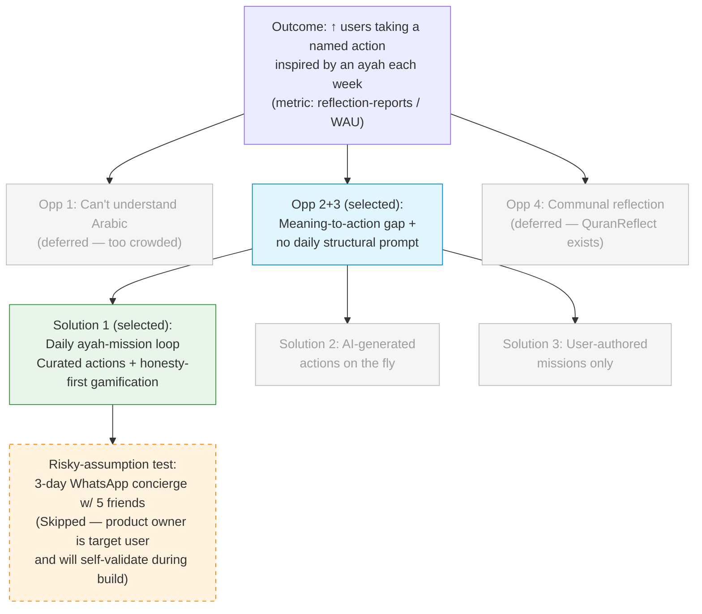

# Discovery Brief: Quran Ayah Apply (working name)

**Context.** Submission for the Quran Foundation Hackathon (launch.provisioncapital.com/quran-hackathon). Theme: technology that strengthens people's lasting connection with the Quran, particularly extending engagement beyond Ramadan. Submission deadline 2026-05-20. Must integrate ≥1 Content API and ≥1 User API.

## Desired Outcome

**Increase the number of users who take a specific, nameable action inspired by a Quranic ayah in a given week.**

Measured in-app as:

- Primary: reflection-reports per active user per week
- Secondary: day-7 retention, weekly-active rate, average streak length

This outcome is chosen because it maps directly to the hackathon's highest-weighted judging criterion (_Impact on Quran engagement_ — 30 of 100 points) and is measurable inside the app without external instrumentation, which is essential for a demo-stage submission.

## Opportunity Map

| #   | Opportunity (user need)                                                                                                            | Evidence                                                                                                                                   | Strength           | Size                                         |
| --- | ---------------------------------------------------------------------------------------------------------------------------------- | ------------------------------------------------------------------------------------------------------------------------------------------ | ------------------ | -------------------------------------------- |
| 1   | Non-Arabic-speaking Muslims can't **understand** what they read                                                                    | Product owner (n=1) + well-documented global need                                                                                          | Strong             | Tens of millions of English-speaking Muslims |
| 2   | Users understand meaning but **can't connect it to daily life**; Quran stays abstract                                              | Product owner lived experience + recurring theme in mainstream English-language Islamic discourse (Nouman Ali Khan, Yaqeen, Omar Suleiman) | Moderate-to-strong | Tens of millions                             |
| 3   | Users lack a **daily structure** that prompts reflection; nothing in the day says "here's today's ayah, what will you do with it?" | Moderate — inferred from ubiquity of post-Ramadan drop-off pattern cited in the hackathon brief itself                                     | Moderate           | Same cohort as #2                            |
| 4   | Social sharing / communal reflection                                                                                               | Inferred                                                                                                                                   | Weak               | Smaller subset                               |

## Selected Opportunity

**Opportunities #2 and #3, treated as a single joined opportunity: the "meaning → action" gap, plus the absence of a daily structural prompt that closes it.**

Rationale:

- **Size** — the non-Arabic-speaking practicing Muslim population is large and underserved at this specific layer (existing apps solve understanding and habits, but not applied reflection).
- **Evidence strength** — moderate-to-strong. Product owner is personally in the target segment; the pain is culturally well-documented.
- **Outcome alignment** — direct. If users translate reading into named actions, the engagement metric moves by construction.
- **Feasibility** — solvable in an 18-day sprint with a well-scoped product.
- **Competitive density** — low for the _apply-and-report_ loop specifically. Translation (Quran.com, Muslim Pro), tafsir (Quran.com, iQuran), habit/streaks (Quran Companion), and social reflection (QuranReflect) all exist; a loop that explicitly bridges meaning to a daily committed action does not appear to exist.

**Deferred, not discarded:** Opportunity #1 (pure comprehension — too crowded a space) and #4 (social reflection — adjacent product QuranReflect already occupies it).

## Solution Candidates

| #   | Solution                                                                                   | Riskiest Assumption                                                                                               | PRD                                                                                 |
| --- | ------------------------------------------------------------------------------------------ | ----------------------------------------------------------------------------------------------------------------- | ----------------------------------------------------------------------------------- |
| 1   | **Daily ayah-mission loop with curated actions and honesty-first gamification** (selected) | Users will return for the _evening_ reflection, not just the morning commit                                       | [docs/specs/TBD-quran-ayah-apply/spec.md](../../specs/TBD-quran-ayah-apply/spec.md) |
| 2   | AI-generated action prompts per ayah, on the fly                                           | LLM-written actions are theologically sound enough to be trusted by practicing Muslims                            | —                                                                                   |
| 3   | User-authored missions (app prompts user to self-define action)                            | Target users — who already struggle to translate meaning to action unassisted — will do the self-scaffolding work | —                                                                                   |

### Selected solution — full description

**Product shape.** A mobile-first web/native app. The daily loop has two touches:

**Morning (user-set time; default Fajr window).** Push notification opens to:

1. Ayah (Arabic + user's chosen translation) with audio playback.
2. A condensed 1–2 sentence tafsir summary (derived from Tafsir API).
3. "Your mission today" card with **2 curated action options plus an "or write your own"** input. User picks one and taps Commit.

On commit: mission is stored, a Forest-style sapling animation begins, and an evening reminder push is scheduled.

**Evening (user-set time; default post-Isha).** Push notification opens to:

1. "Did you act on it?" — _Yes, fully / Partly / Not today._
2. "What happened?" — freeform reflection (minimum 40 characters to count).

On submit: tree completes, streak and grove update, reflection saved to private journal.

**Four anti-streak-farming mechanics** (the design discipline that separates this from a gamification-wrapper app):

1. **"Not today" counts as a completed check-in, not a break.** The streak only breaks if the user doesn't open the app at all. Honesty is rewarded; absence is the only thing penalized. (Quranic framing: _Allah does not burden a soul beyond what it can bear._)
2. **Reflections must be ≥ 40 characters** to grow the tree. Blank or "done" submissions do not count. Low enough to be humane, high enough to force a thought.
3. **The streak is not the home-screen hero metric.** The home screen shows a growing "grove" (one tree per completed reflection) and a cumulative "ayat reflected on this month" count — emphasising cumulative meaningful engagement over consecutive-day anxiety.
4. **Weekly grove review.** On day 7 of an active week, the user sees all 7 ayat and their 7 reflections in one scroll as a _"Here's what Allah guided you through this week"_ summary — directly reinforcing the meaning-to-life outcome.

**Content strategy.** Target corpus of **60+ curated ayat** at launch. Production path: AI-drafted actions per ayah, with every single string **human-edited by the product owner** before shipping. No un-reviewed AI output reaches users; theology is safeguarded by editorial control. This path gets a demo-ready corpus produced in hours of writing time, not days.

**API utilisation.** Targets near-maximum scoring on the 15-point _API integration quality_ criterion:

- Content APIs (4/5): **Quran, Translation, Tafsir, Audio**.
- User APIs (3/4): **Bookmarks** (save favourite ayat and their reflections), **Streak Tracking** (core loop), **Activity/Goals** (weekly grove review).

Every integration is load-bearing — not decorative — which is the differentiator against submissions that hit the 1+1 minimum.

## Opportunity Solution Tree

## Recommended Experiment

**Pre-build concierge test (documented, intentionally not run).**

Design: for 3 consecutive days, the product owner personally sends 5 target-persona friends (practicing, non-Arabic-speaking, read Quran occasionally) a WhatsApp message at \~8am containing one ayah, translation, and 2 action options; a follow-up at \~9pm asks what happened. Success bar: ≥3 of 5 respond unprompted in the evening on ≥2 of 3 nights. This tests the product's single riskiest assumption — _users will return for the evening reflection, not just the morning commit_ — before sinking build effort into the evening screen.

**Explicit decision: experiment skipped.** Rationale: (a) the product owner is themselves the target user and can self-validate the loop during the build, and (b) the 18-day sprint window makes calendar days the binding constraint. The assumption is accepted as a live risk, not retired; during the sprint, if the product owner notices in their own usage that the evening return is weak, the design contingency is to **merge the reflection into the next morning's session** (single daily touch) rather than ship a broken two-touch loop.

## Recommendation

**Proceed to `/prd`** using this brief as input. Suggested PRD framing: a single-epic product with the following story slicing, in priority order so the first 3 stories form a shippable minimum cut if the sprint tightens:

1. **Morning loop** — ayah display (Quran/Translation/Audio/Tafsir APIs), mission card with curated actions, commit interaction.
2. **Evening loop** — reflection form, streak update, tree-growth feedback.
3. **Grove home screen** — cumulative grove visualisation, "reflected this month" count, quiet streak display.
4. **Weekly grove review** — 7-day scrollable summary (Activity/Goals API).
5. **Notifications & timing** — user-configurable morning + evening push schedules.
6. **Bookmarks** — save favourite ayah-reflection pairs (Bookmarks API).
7. **Content corpus tooling** — minimal admin/seed script to ingest the 60+ curated ayat.

## Decision Log

- **Outcome framed as "named actions per week"** rather than "daily active users" because the hackathon's _Impact on Quran engagement_ criterion rewards depth of engagement, not vanity DAU.
- **Merged Opportunities #2 and #3** into a single selected branch — the "meaning-to-action gap" and the "no daily structural prompt" are two sides of the same user problem in practice.
- **Rejected Opportunity #1** (pure comprehension) despite strong evidence because the competitive density is high and no realistic 18-day build would differentiate there.
- **Selected Solution #1** (curated action library + honesty-first gamification) over AI-generated actions (theology risk, lazy-signal to judges) and user-authored missions (too much cognitive load on the exact user we're trying to help).
- **Content approach: AI-drafted, 100% human-edited corpus, 60+ ayat target.** Chosen over writing from scratch (too slow) and pure AI (quality/theology risk). Every shipped string is human-approved, which is what the judges will experience.
- **Forest gamification inspiration accepted, but integrity-hardened.** Four specific mechanics (honest "Not today", 40-char minimum, streak de-emphasised, weekly grove review) address the self-report integrity problems that naive streak mechanics produce.
- **Skipped pre-build experiment.** Rationale recorded above; risk accepted; contingency (merge to single daily touch) defined.
- **API integration set: 4 Content + 3 User APIs.** Deliberate over-achievement against the 1+1 minimum to maximise the 15-point _API integration quality_ criterion.

## Open Questions (carry forward to `/prd`)

- **Platform.** Web app (PWA), native iOS/Android, or responsive web? Decision affects push-notification reliability, which is central to the loop. Recommend PWA for sprint feasibility unless product owner has strong native preference.
- **Auth model.** Anonymous device-local storage, email-based, or OAuth? Affects how streaks/reflections persist across devices and how the Quran Foundation User APIs are called. Simplest path: anonymous + optional account.
- **Default translation.** Sahih International? Mustafa Khattab (Clear Quran)? Or user-selectable on first run? Recommend user-selectable with Clear Quran as default.
- **Tafsir source.** Which tafsir(s) does the Tafsir API expose, and which does the product owner want surfaced? Ideally mainstream (Ibn Kathir, As-Sa'di). Condensation strategy (full tafsir is long) needs a defined rule — LLM summary vs. fixed word limit extract.
- **Notification timing defaults.** "Fajr window" and "post-Isha" require prayer-time data (location) or fixed defaults (e.g., 7am / 9pm). Confirm approach.
- **Corpus ayah selection criteria.** Which 60+ ayat? Recommend a thematic spread: character/akhlaq, worship, family, patience, dhikr, gratitude, trust in Allah, justice — so the weekly grove review feels diverse.
- **Content review gate.** Is any second set of eyes (even an informal one) going to review the curated actions before submission? Not blocking, but worth considering.
