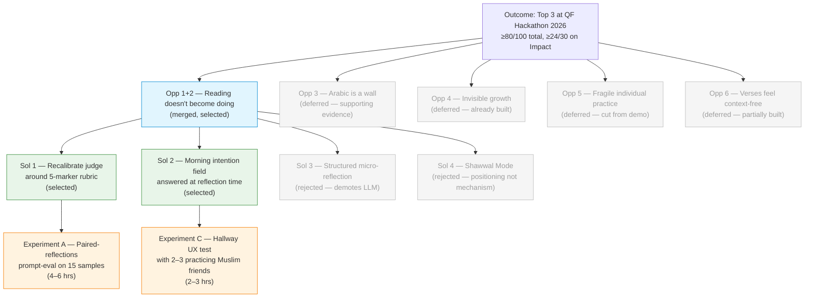

# Discovery Brief: Reading Becomes Doing — from Ramadan to Year-Round

## Desired Outcome

By **May 20, 2026**, place top 3 in the Quran Foundation Hackathon 2026 with a
total rubric score of **≥80/100**, anchored by **≥24/30 on "Impact on Quran
Engagement"** — the largest and hardest-to-fake axis.

The sub-target on the 30-point Impact axis is deliberate: if Impact lands at 24+,
the app can afford middling scores on the other four axes (Product Quality & UX,
Technical Execution, Innovation & Creativity, Effective API Use) and still place.
If Impact lands at 18, no amount of polish elsewhere saves placement.

## Opportunity Map

| #   | Opportunity                                                                                                                                                      | Evidence                                                                                                                                                                                       | Strength | Size                                                  |
| --- | ---------------------------------------------------------------------------------------------------------------------------------------------------------------- | ---------------------------------------------------------------------------------------------------------------------------------------------------------------------------------------------- | -------- | ----------------------------------------------------- |
| 1   | Users reconnect with Quran during Ramadan but can't hold the practice when structure disappears                                                                  | Hackathon brief states this verbatim as the core problem space. Lived experience of the founder + widely observed in English-speaking Muslim community.                                        | Strong   | Tens of millions of Muslims post-Ramadan              |
| 2   | Reading/reciting doesn't become understanding or application — users complete the motion but don't feel changed by it                                            | Founder's own observation that the current reflection judge rewards thoughtful writing, not evidence of application. Common refrain in community: "I read but don't internalize."              | Strong   | Majority of non-Arabic-native Quran readers           |
| 3   | Arabic is a wall — most non-native readers recite without understanding, and separate vocabulary apps feel disconnected from reading                             | Dozens of Arabic-learning apps exist but are siloed from Quran reading. Ghars already ships a word-of-day + species-unlock vocabulary loop.                                                    | Strong   | Most non-Arabic-native readers                        |
| 4   | Growth in practice is invisible — a streak number doesn't capture cumulative spiritual or intellectual progress, so motivation erodes silently                   | Inferred from general habit-formation research + the fact that every successful habit app (Duolingo, Strava, Strong) invests heavily in visible progress. Ghars's garden plant addresses this. | Moderate | All serious practice-habit users                      |
| 5   | Individual practice is fragile — without communal accountability, private habits collapse; existing Muslim apps either have guilt-driven social features or none | Accountability buddies / halaqa / study circles are widely established in the community. Ghars ships private circles.                                                                          | Moderate | Users who already have a Muslim social network        |
| 6   | Verses feel context-free — users read translations without knowing why the verse was revealed or how to apply it. Tafsir exists but is buried or overwhelming    | Tafsir literature is famously dense; accessible short-form framing is rare. Ghars integrates Ibn Kathir and LLM-generated missions.                                                            | Moderate | Serious Quran readers who currently bounce off tafsir |

## Selected Opportunity

**Merged Opportunity 1 + 2 — _"Reading doesn't become doing. Ramadan's reading
habit collapses in Shawwal because the practice isn't anchored to daily life."_**

The merger is legitimate because application is the _mechanism_ by which
post-Ramadan retention happens — they are not two separate problems. If every
verse produces a concrete action today, users come back tomorrow to see what
verse comes next. If verses produce only thoughtful prose, the habit is
indistinguishable from any other reading habit and collapses when structure
(Ramadan) disappears.

**Selection criteria:**

- **Size** — every post-Ramadan Muslim who has fallen off the habit; population in the tens of millions.
- **Evidence** — strong; stated verbatim in the hackathon brief, supported by founder's lived experience, and confirmed by the observation that the current Ghars judge rewards eloquence rather than application.
- **Outcome alignment** — directly targets the 30-point "Impact on Quran Engagement" axis; judges are literally scored against a rubric matching this opportunity.
- **Feasibility** — the core reflection loop already exists; the gap is rubric recalibration, one new touchpoint, and demo framing — not new infrastructure.

**Deferred, not discarded:**

- **Opp 3 (Arabic as a wall)** — word-of-day + species unlock already shipped; remains as _supporting evidence_ in the demo video, not as the hero thesis.
- **Opp 4 (invisible growth)** — garden plant already serves this; no new work needed.
- **Opp 5 (communal accountability)** — circles remain in the app but stay cut from the demo per the existing DEMO_SCRIPT.md decision.
- **Opp 6 (verses feel context-free)** — tafsir integration + LLM missions already partially address this; leave as-is.

These remain on the tree and contribute to the 15-point Innovation and 20-point
Product Quality axes. The 30-point Impact axis is now singularly focused.

## Solution Candidates

| #   | Solution                                                                                                                                                                                                                                                                                                                                                                                                      | Riskiest Assumption                                                                                                                                                                                                                                      | PRD |
| --- | ------------------------------------------------------------------------------------------------------------------------------------------------------------------------------------------------------------------------------------------------------------------------------------------------------------------------------------------------------------------------------------------------------------- | -------------------------------------------------------------------------------------------------------------------------------------------------------------------------------------------------------------------------------------------------------- | --- |
| 1   | **Recalibrate the reflection judge around a visible 5-marker application rubric.** Response shows the score, which markers were present, which were missing, and a one-sentence nudge. Markers: (1) specific moment, (2) behavioral change, (3) temporal anchor, (4) honest friction, (5) next step. Threshold for a high score: ≥3 of 5. Connection to the specific verse is _not_ required — ease users in. | Users write more applied reflections when shown the rubric, rather than (a) gaming the markers mechanically or (b) being intimidated into writing less.                                                                                                  | —   |
| 2   | **Add a lightweight morning intention field to the mission card.** One line, optional, pre-filled with a suggestion. At reflection time the user responds to _their own earlier intention_. Judge scores the reflection against both the intention and the 5 markers. If the morning intention is skipped, the flow falls back cleanly to Solution 1 alone.                                                   | Users will actually set the morning intention, despite it being a second daily touchpoint. Keeping it optional and pre-filled mitigates the ~30–40% DAU hit typically seen with two-touchpoint apps.                                                     | —   |
| 3   | _(Rejected)_ Replace free-text reflection with a tiny structured micro-form (one line per marker, no LLM judge).                                                                                                                                                                                                                                                                                              | Structured form feels richer, not reductive. Also demotes the LLM from the critical path — a cost for the 15-point Effective API Use score. Rejected primarily because of the API-score cost.                                                            | —   |
| 4   | _(Rejected)_ "Shawwal Mode" — a feature activated April 1–30 with a separate Shawwal streak + pre/during/post-Ramadan chart.                                                                                                                                                                                                                                                                                  | Temporal-context feature is more compelling to judges than a mechanism improvement. Rejected because it addresses positioning, not the core thesis; the demo video can still use "designed for the month after Ramadan" framing without a separate mode. | —   |

**Chosen bundle: Solutions 1 + 2.** Solution 1 makes the mechanism true to the
thesis; Solution 2 compounds the effect by giving the evening reflection something
specific to report against.

## Opportunity Solution Tree

## Recommended Experiment

**Unified riskiest assumption being tested:** _Users who see a visible 5-marker
rubric AND are asked for a morning intention will write reflections that show
more evidence of actual application than users who just see the current
"how did it go?" prompt._

**Experiment A — Paired-reflections prompt-eval (4–6 hours)**

- Write 15 sample reflections spanning the quality spectrum (shallow contemplative, deep applied, mixed, and edge cases such as "I tried but failed," "I forgot until now," and purely emotional responses).
- Score each sample yourself first on a 1–5 scale to establish ground truth.
- Run the current "depth" judge and the new 5-marker judge on the same 15.
- Success criteria:
  1. The new judge's ranking correlates with your ground truth better than the current judge's ranking (Spearman ρ ≥ 0.7).
  2. On the subset of _applied-but-inelegant_ samples, the new judge scores them ≥1 point higher than the current judge. (This is the thesis: evidence over eloquence.)
  3. Rubric feedback names the present/missing markers correctly in ≥12 of 15 samples.

**Experiment C — Hallway UX test (2–3 hours)**

- Build the new mission card + optional intention field + reflection form with 5-marker feedback.
- Show it cold to 2–3 practicing Muslim friends, in person or over a call.
- Ask: "Walk me through your morning. Would you fill in the intention? Why or why not?" and "Here's the evening reflection with the 5-marker feedback — does this feel like growth or like judgment?"
- Success criteria:
  1. ≥2 of 3 say they would actually fill in the morning intention at least 3 days a week.
  2. ≥2 of 3 describe the reflection feedback as "helpful" / "encouraging" / "makes me want to try again tomorrow" rather than "harsh" / "like being graded."
  3. Zero participants describe the flow as "too much work" or "another thing to do."

**Total cost:** ~8 hours. Leaves roughly 17 days for implementation, polish, and
demo recording.

## Recommendation

Proceed to `/prd` for the bundled Solution 1 + Solution 2 targeting the merged
Opportunity 1+2.

Suggested PRD scope:

- **Story 1 — Reflection judge v2 (5-marker rubric).** LLM prompt rewrite, scoring schema, UI for marker feedback.
- **Story 2 — Morning intention field.** UI on mission card, persistence, pre-fill suggestion generation, display at reflection time.
- **Story 3 — Demo-video realignment.** Rewrite DEMO_SCRIPT.md around the new thesis — _"your Quran practice survives Ramadan because you're actually living the verses, not just reading them"_ — and specifically show the 5-marker feedback on camera. Name Claude's role once explicitly when the markers animate in.

Run Experiments A and C _before_ committing to the full Story 1 and Story 2
implementations. If Experiment A fails criterion 2 (inelegant-but-applied samples
not rewarded), iterate the prompt before building the UI. If Experiment C fails
criterion 1 (users won't set intentions), cut Story 2 and ship Story 1 alone.

After building, run `/discover update ramadan-to-year-round` to record what the
demo judges actually responded to — that closes the loop and teaches the next
iteration.

## Decision Log

- **Goal framing: "win while learning, aim for top 3."** → Outcome anchored on the 30-point Impact axis (≥24) because that is where placement is decided and because it is the rubric axis most aligned with genuine product thinking — which is the "learning" side of the hybrid.
- **Opportunity 1 and 2 merged.** Application is the mechanism by which post-Ramadan retention happens; they are not separable.
- **Rejected the "all six opportunities" instinct.** A 2:30 demo video can only land one thesis; breadth without focus scores as "nice idea, unclear focus" (18–20/30 on Impact).
- **Hero thesis locked as:** _"Ghars turns Ramadan's reading habit into a year-round practice by asking, every day, what you did about the verse — and scoring your answer against evidence of living it, not eloquence about it."_
- **"Actually" softened from the thesis.** Founder acknowledged (Grill #4) that there is no evidence supporting a claim that other apps let users "pretend to engage." The softer framing — "evidence of living it" — is defensible on mechanism alone.
- **5-marker application rubric locked:** specific moment; behavioral change; temporal anchor; honest friction; next step. Threshold for high score: ≥3 of 5. Founder approved.
- **Connection to the specific verse is _not_ required in the rubric.** Founder's explicit choice: "we should ease the user in using and reflecting. it must not be forced."
- **Solution 3 (structured micro-reflection) rejected** because removing the LLM judge from the critical path costs points on the 15-point Effective API Use rubric axis, and the structured form feels more like a survey than a reflection.
- **Solution 4 (Shawwal Mode) rejected as a feature** but _kept as a demo-framing idea._ The video can still position the app as "designed for the month after Ramadan" without requiring a separate mode.
- **Experiment B (7-day dogfood sprint) rejected** because 7 days is ~37% of the remaining hackathon window and the signal from n=1 founder usage is weak when the founder already believes in the thesis. Experiments A + C chosen instead — they test different failure modes (LLM judgment quality and UX acceptability) in ~8 hours combined.

## Open Questions

These carry forward to `/prd`:

- **Marker feedback UX.** Should the 5 markers animate in as discovered ("Specific moment ✓… Behavioral change ✓… Honest friction ✓…") like Duolingo's correctness feedback, or appear as a single block? Affects demo visual impact.
- **Intention pre-fill strategy.** Should the suggested intention be LLM-generated from the mission, a template ("Where/when will I try this today?"), or a rotating set of seed prompts? Different costs and feel.
- **Score display.** Keep the 1–5 numeric score, replace it with the count of markers hit (e.g. "3 of 5"), or hide the score entirely and only show markers? Scoring feels like grading; marker count feels like a checklist. Not yet decided.
- **Historical reflections in the journal.** When the rubric changes, do old reflections keep their old scores, get re-scored, or show "scored under v1"? Affects the /reflections journal UX.
- **Demo video re-record timing.** Experiments A+C should complete by day 3–4; re-record DEMO_SCRIPT.md on day 17–18 once the rubric UI is final. Flagged so it isn't forgotten in the build sprint.
